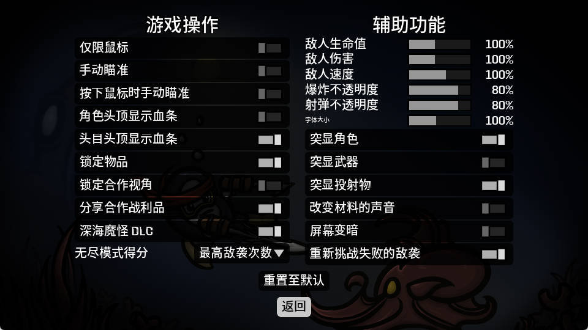

# Brotato AI Playrer

## 简介

训练 AI Agent 在[土豆兄弟(Brotato)](https://store.steampowered.com/app/1942280/Brotato/)游戏中控制角色移动，通关游戏。

> 仅控制角色移动，不包含升级加点、商店购物等动作。

项目主要包含以下部分：

1. 获取游戏窗口捕获画面
2. 通过**图像分类**进行游戏场景识别
3. 通过 **OCR** 识别当前生命值、材料数等文本
4. 通过**强化学习**训练控制角色移动

## 工程说明

目录结构及主要文件：

```shell
brotato-ai-player
├─brotato-ai-player     # 代码目录
│  │    brotato.py          # 游戏信息
│  │    brotato_action.py   # 游戏动作
│  │    brotato_env.py      # 强化学习训练环境
│  │    capture.py          # 画面捕获程序
│  │    main.py             # 强化学习模型运行入口
│  │    ocr.py              # OCR 识别封装
│  │    train_img_cls.py    # 图像分类训练代码
│  │    train_ppo.py        # 强化学习训练代码
│  │    window.py           # 通用窗口捕获程序
│  │    yolo11-cls.yaml     # 图像分类训练配置文件
│  └─assets                 # README 图片目录
├─datasets              # 数据集目录
│  └─brotato-cls            # 图像分类训练数据集目录
│     ├─test                    # 数据集测试图片目录
│     └─train                   # 数据集训练图片目录
├─captured              # 捕获画面保存目录，程序生成
├─logs                  # 强化学习训练日志保存目录，程序生成
└─models                # 预训练模型存放目录
        brotato-cls.onnx    # 图像分类模型
        ppo_brotato.zip     # 强化学习模型
```

训练基于以下游戏设置：




> 游戏窗口尺寸默认为960x540

## 环境搭建

创建与启用 conda 环境：

```shell
conda create -n brotato-ai-player python=3.12.3 -y
conda activate brotato-ai-player
```

安装依赖：

```shell
pip install -r requirements.txt
```

## 运行

**注意事项**：

1. 游戏设置需尽可能与训练采用的设置保持一致

启动游戏，执行以下命令运行强化学习模型，手动操作游戏进入地图场景后模型开始控制角色移动：

```shell
python .\brotato-ai-player\main.py
```

## 训练图像分类模型

图像分类基于 YOLO 模型，项目中已提供训练好的图像分类模型`models\brotato-cls.onnx`，该模型训练数据集包括碰撞区域（Crash Zone）和深渊（The Abyss）两个地图。自行训练需要先采集训练用的图片并准备训练数据集。

1. 游戏画面捕获保存

启动游戏，执行以下命令开始捕获，随后手动进行游戏。捕获的图片保存在`captured`目录下：

```shell
python .\brotato-ai-player\capture.py
```

2. 准备数据集

图像分类的默认训练数据集路径为`datasets\brotato-cls`，需要将捕获的图片按照特定的目录结构整理存放：训练图片放在`train`目录下，按照文件夹分类，每一个文件夹代表一个类别（对应到程序中定义的枚举类 - `brotato-ai-player\brotato.py` - `class Scene(Enum)`），参考`datasets\brotato-cls\train\<类别文件夹>`下已有的图片进行添加；测试图片放在`test`目录下。

3. 训练

执行以下命令进行训练，模型保存位置见控制台日志（参考：`model export to: runs\classify\train\weights\best.onnx`）：

```shell
python .\brotato-ai-player\train_img_cls.py
```

训练完成后将导出的模型替换掉默认的`models\brotato-cls.onnx`。

## 训练强化学习模型

项目中提供的强化学习模型通过修改游戏内容逐步训练得到，自行训练需要另外控制游戏执行加载存档等操作。

在现有基础上继续训练/重新进行训练：

启动游戏，执行以下命令开始训练：

```shell
python .\brotato-ai-player\train_ppo.py
```

## 可能出现的问题

### 安装依赖报错

部分依赖库的版本更新后，旧版本可能无法安装：

- 尝试修改 requirements.txt 中的版本限制或手动安装。

### 捕获画面尺寸不正常

可能与系统缩放设置有关：

- 尝试将缩放设置修改为100%
- 调整画面采集程序中的缩放处理 - `brotato-ai-player\windows.py` - `___handle_scale(self, width, height, left_off, top_off)`

> 土豆兄弟2024.10.25更新深海魔怪DLC支持的版本（version 1.1.x.x）后，系统缩放设置对游戏窗口大小的影响与历史版本（version 1.0.x.x）不同，画面采集逻辑存在一定差异

> 系统缩放设置参考：Windows11 桌面右键->显示设置->缩放和布局下的缩放设置

### 训练图像分类模型报错提示"Dataset not found"

将`train_img_cls.py`中的`DATA_PATH`改为`brotato-cls`目录的绝对路径

## 引用项目

1. 图像分类：[ultralytics/ultralytics: Ultralytics YOLO11 🚀](https://github.com/ultralytics/ultralytics)
2. OCR 识别：[RapidAI/RapidOCR: Awesome OCR multiple programing languages toolkits based on ONNXRuntime, OpenVION and PaddlePaddle.](https://github.com/RapidAI/RapidOCR)
3. 强化学习：[DLR-RM/stable-baselines3: PyTorch version of Stable Baselines, reliable implementations of reinforcement learning algorithms.](https://github.com/DLR-RM/stable-baselines3)

## 参考项目

1. [linyiLYi/street-fighter-ai: This is an AI agent for Street Fighter II Champion Edition. (github.com)](https://github.com/linyiLYi/street-fighter-ai)
2. [analoganddigital/DQN_play_sekiro: DQN_play_sekiro (github.com)](https://github.com/analoganddigital/DQN_play_sekiro)

